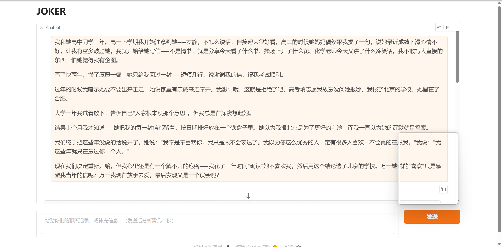
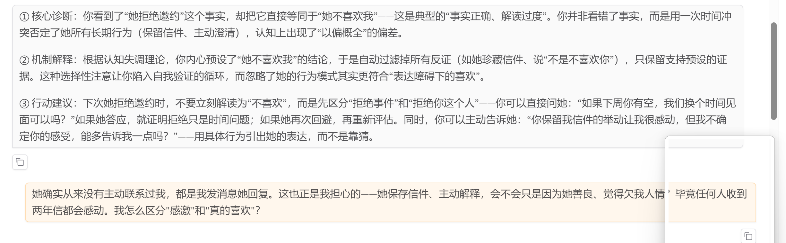
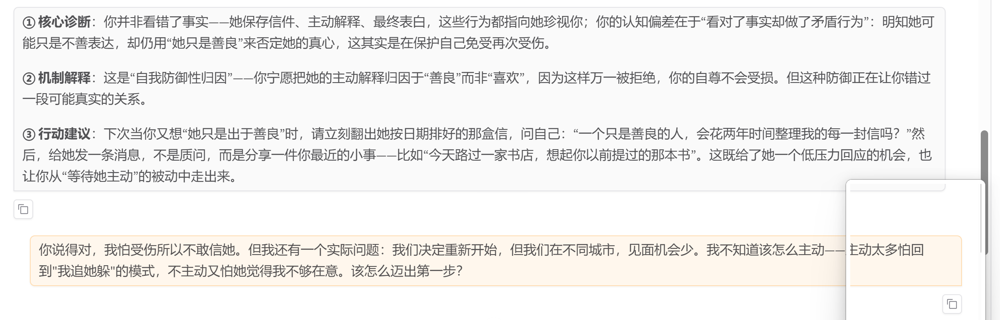
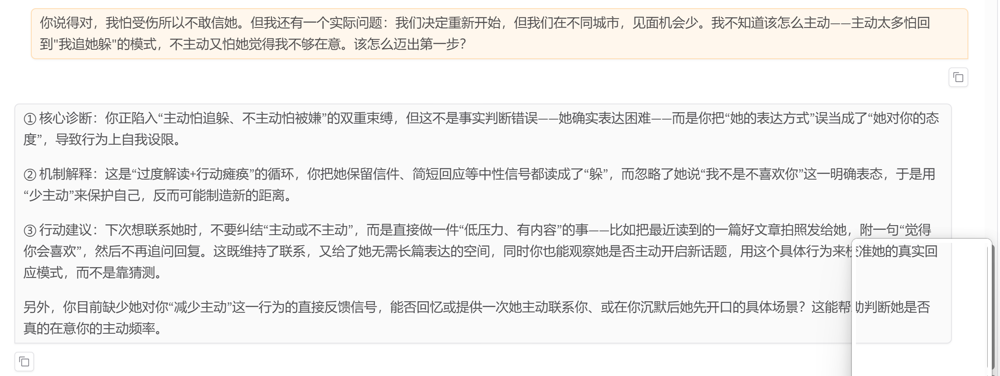

# Joker — 恋爱关系认知校准官

> 基于 LangGraph 的多节点认知分析管线，帮你发现恋爱中「以为自己看清了，其实没看清」的偏差。

[](https://python.org)
[](https://github.com/langchain-ai/langgraph)
[](LICENSE)

**线上 Demo：** [https://bot.hzd-ms.com/joker-demo](https://bot.hzd-ms.com/joker-demo)

---

## 为什么做这个

高中三年，我给喜欢的女孩写了两年信。她只回过一封，短短几行。过年约她出来走，她说家里走不开。我想：哦，这就是拒绝。我报了北京的学校，她留在了合肥。

上个月才知道——她把每一封信按日期排好，放在一个铁盒子里。她说：「我不是不喜欢你，我只是太不会表达了。」

我花了三年「确认」她不喜欢我，然后用这个结论选了北京的学校。如果当时多问一句呢？

**人用感受推演对方的想法，感受是偏差工厂。** 我没有任何客观证据，却用三年建了一座自以为坚固的逻辑大厦——然后它在一个铁盒子面前塌了。

Joker 想做的是：把「猜对方在想什么」这件事，从直觉的黑箱里拿出来，变成可检查、可反证、可校准的结构化流程。

## 这是什么？

Joker 是一个**关系认知分析引擎**。你粘贴聊天记录或描述一段关系困惑，它会：

1. **提取你所有的隐式主张**（「ta 不喜欢我」「ta 只是感激我」…）
2. **为每个主张找证据和替代解释**（不让你只看自己想看的）
3. **检查信息对称性**（ta 知道你知道的那些事吗？）
4. **检测矛盾**（你的结论和你的行为是不是在打架？）
5. **基于心理学理论给出诊断**（不套模板，只挑机制匹配的理论）

### vs 通用 Chatbot

| | Joker | ChatGPT / DeepSeek |
|---|---|---|
| **输出结构** | 8 节点管线确保每个 claim 都经过证据、替代解释、信息对称性三重检查 | 单次 LLM 调用，无结构保证 |
| **幻觉控制** | Prompt 约束 → 代码校验 → retry_hint 三层防御；checklist 模式让 LLM 只做选择题不做数字题 | 依赖 prompt 措辞，无代码层防御 |
| **多视角验证** | evidence + alternative + info_symmetry 三个独立节点交叉验证 | 单一回复视角，无内置对立面检查 |
| **理论引用** | RAG 检索 10 张心理学卡片，特异性优先匹配（不强行套模板） | 靠训练数据记忆，常把一切归因于「焦虑型依恋」 |
| **多轮记忆** | MemorySaver 自动续上下文 + SqliteStore 持久化 profile | 无状态或仅上下文窗口内记忆 |
| **路由决策** | supervisor 纯代码路由（非 LLM），不受 LLM 随机性影响 | 依赖 prompt 或 LLM 自行判断，不可控 |

## Demo 演示（3 轮对话）

**场景**：高中互相暗恋三年，因双方都不善表达而误会彼此不在乎。上个月坦白后决定重新开始，但用户仍有心结。

### 全景



### 第 1 轮 — 故事倾诉 + 初始诊断

用户倾诉三年误会。Joker 诊断「以偏概全 + 认知失调」——把一次拒绝邀约等同于对方不喜欢，过滤掉她珍藏信件、主动澄清等反证。给出具体建议并主动追问信息缺口。



### 第 2 轮 — 深入追问「感激 vs 喜欢」

用户追问「她不主动联系我，喜欢会不会只是感激？」。Joker 指出这是**自我防御性归因**——宁愿把真心解读为善良，因为这样万一被拒绝自尊不会受损。用「铁盒子按日期整理」作为锚点反驳。



### 第 3 轮 — 异地行动建议

用户问「异地怎么迈出第一步？」。Joker 诊断**过度解读 + 行动瘫痪**——焦虑在替对方做决定，导致在主动跟不主动间摇摆。给出低压力行动框架：分享而非质问，观察而非猜测。



## 管线架构

```
                    ┌──────────────┐
                    │  preprocess  │  文本 → claims 提取 + direction 判定
                    └──┬────────┬──┘
                       │        │
              ┌────────┘        └────────┐
              ▼                          ▼
      ┌──────────────┐          ┌───────────────┐
      │  signals     │          │  supervisor   │  纯代码路由，不调 LLM
      │  (并行支线)  │          └───────┬───────┘
      └──────────────┘                  │
                         ┌──────────────┼──────────────┐
                         ▼              ▼              ▼
                  ┌──────────┐  ┌──────────────┐  ┌─────────────┐
                  │ evidence │  │ alternative  │  │ info_       │
                  │ 证据收集 │  │ 替代解释     │  │ symmetry    │
                  └────┬─────┘  └──────┬───────┘  │ 信息对称性  │
                       │              │           └──────┬──────┘
                       └──────────────┼──────────────────┘
                                      ▼
                          ┌──────────────────────┐
                          │  contradictory       │  汇总 weak_evidence
                          │  registration        │  + alternative gaps
                          └──────────┬───────────┘
                                     ▼
                          ┌──────────────────────┐
                          │  summary            │  三段诊断 + 行动建议
                          │  (记忆写入 Store)    │  + 长期记忆持久化
                          └──────────────────────┘
```

### 8 个节点

| 节点 | 做什么 |
|------|--------|
| **preprocess** | 文本拆解为 claims，判定 `direction`（single / both） |
| **signals** | 并行运行 — 从文本中提取用户和 ta 的行为信号，量化评分 |
| **supervisor** | 纯代码路由 — 根据 pending claims 决定下一步调用哪些分析节点 |
| **evidence** | 为每个 claim 搜索支持证据，计算 `credit_score` |
| **alternative** | 为每个 claim 生成替代解释，判定 claim 类型（事实 vs 解读） |
| **info_symmetry** | 只对 `direction="both"` 的 claims 执行 — 检查双方信息是否对等 |
| **contradictory** | 汇总弱证据和替代解释缺口，标记 `type` 区分来源 |
| **summary** | 三段结构诊断（偏差 → 机制 → 行动），写入长期记忆 |

## 核心技术特点

### 1. JSON-only 输出（非 Function Calling）

所有节点 prompt 要求 LLM 输出纯 JSON，通过 `_extract_json()` 三层 fallback 解析：

```python
# 1. json.loads 直接解析
# 2. 正则提取 ```json ``` 代码块
# 3. 找第一个 { 到最后一个 }
```

**为什么不用 Function Calling？** DeepSeek 的 tool_calling 不稳定——需要 LLM 多做一步「选哪个 tool + 填什么参数」的决策，4层嵌套 JSON schema 经常输出错位。

### 2. Checklist 模式：LLM 定性、代码定量

LLM 不擅长拍数字。Joker 的解法：

- **类型 A（代码查表）**：prompt 让 LLM 回答 checklist 选择题（如「ta 的回应是 A/B/C/D？」），代码按映射表计算分数
- **类型 B（规则判定）**：纯代码判断（如 `direction` 判定）
- **类型 C（离散尺度）**：无法标准化但需结构化（如 `could_be_otherwise` → true/false）

### 3. 三层输出防御

```
Prompt 约束（规则 + 示例）
    ↓ 漏了
代码校验（validate_and_fix: setdefault 补齐 → 类型校验 → 范围裁剪）
    ↓ 还漏
retry_hint（把失败原因注入下一轮 prompt）
```

### 4. RAG 知识增强

内置 10 张心理学理论卡片（确认偏误、认知失调、情绪推理、依恋理论等），BGE embedding → numpy 余弦检索。检索时区分嵌入字段和不嵌入字段——`common_misinterpretations`（否定语义）不嵌入，避免污染向量方向。

### 5. 两层记忆

| | Checkpointer (MemorySaver) | Store (SqliteStore) |
|---|---|---|
| **管什么** | 单会话多轮状态 | 跨会话长期记忆 |
| **读写时机** | 自动（每次节点执行） | 手动（preprocess 读，summary 写） |
| **本质** | 自动续上下文 | 手动存 profile + timeline |

## 技术栈

- **编排**：LangGraph StateGraph + 条件路由
- **模型**：DeepSeek-chat (T=0)
- **嵌入**：BGE-base-zh-v1.5 (sentence_transformers)
- **检索**：numpy 余弦相似度（10-50 张卡片，无需外部向量数据库）
- **前端**：Gradio 6
- **记忆**：MemorySaver + SqliteStore
- **评估**：RL 打分（RAG recall + 结构完整性 + LLM 裁判覆盖度 + 正确性 MCQ）

## 评估指标

基于 10 个 golden dataset 场景（easy/medium/hard）：

| 指标 | 分数 | 说明 |
|------|:---:|------|
| RAG Recall@1 | 0.60 | 首位检索命中率 |
| RAG Recall@3 | 0.93 | 前三位命中率 |
| 结构完整性 | 0.92 | graph 是否跑完、各节点是否产出 |
| 覆盖度（裁判） | 0.57 | LLM 裁判对分析覆盖度的评判 *（受限 RAG 卡片仅 10 张，理论覆盖面不足；扩展卡片库后预期大幅提升）* |
| 正确性（裁判） | 0.93 | 3 道 MCQ → 代码查表算分 |
| **加权总分** | **0.84** | — |

## 快速开始

```bash
# 1. 克隆
git clone https://github.com/mstiandi/my_joker.git
cd my_joker

# 2. 安装依赖
pip install langgraph langchain langchain-openai openai gradio sentence_transformers

# 3. 设置 API Key
export DEEPSEEK_API_KEY=sk-your-key-here

# 4. 启动
python -m achievement_graph.thought_v1.app
# → http://127.0.0.1:7860
```

## 项目结构

```
my_joker/
├── achievement_graph/thought_v1/    # 主管线
│   ├── graph.py                     # 图结构 + 编译
│   ├── app.py                       # Gradio 前端入口
│   ├── nodes/                       # 8 个节点的实现
│   └── state/JokerState.py          # 状态定义 + TypedDict
├── tools/
│   ├── llm/                         # LLM 调用 + JSON 提取
│   ├── context/                     # Token 预算 + 压缩 + prompt 构建
│   ├── memory/sqlite_store.py       # 长期记忆
│   ├── rag/                         # BGE 嵌入 + numpy 检索
│   ├── eval/                        # 评估框架 (scorer + judge + runner)
│   └── reducer/                     # State reducer
└── prompts/                         # 各节点的 System Prompt (.md)
```

## 已知局限

- **同模型裁判偏袒**：用 DeepSeek 评判 DeepSeek 的输出存在隐性宽容，理想方案是用 GPT-4o-mini 做交叉裁判
- **DeepSeek Function Calling 不稳定**：已全部改为 JSON-only，换 OpenAI 模型时可能需要重新评估
- **RAG 卡片少**：10 张卡片够用但覆盖面有限，1000 张以上需考虑换 ChromaDB 等外部向量数据库
- **依赖 sentence_transformers**：首次运行需下载 BGE 模型（~400MB），轻量部署可注释 RAG 模块

## License

MIT
